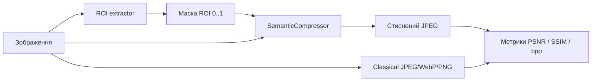

# Семантичне стиснення зображень (ROI + deep learning)

Desktop-застосунок для дослідження та порівняння **класичного** і **семантичного** стиснення зображень. Ключова ідея: спочатку виділити **область інтересу (ROI)** за допомогою нейромереж, потім застосувати **адаптивну якість JPEG** — вищу в ROI, нижчу на фоні — і порівняти результат із однорідним JPEG/WebP/PNG.

Проєкт орієнтований на дипломну роботу: інтерактивний GUI, відтворювані метрики (PSNR, SSIM, bpp), візуалізація масок і карт якості.

---

## Зміст

- [Ідея та pipeline](#idea-pipeline)
- [Можливості](#features)
- [Системні вимоги](#requirements)
- [Швидкий старт](#quick-start)
- [Детальне встановлення](#installation)
- [Робота з GUI](#gui)
- [Методи виділення ROI](#roi-methods)
- [Ultralytics SAM (інтерактивне ROI)](#ultralytics-sam)
- [Алгоритми стиснення](#compression)
- [Метрики якості](#metrics)
- [Налаштування (`configs/default.yaml`)](#configuration)
- [Структура проєкту](#project-structure)
- [Тести](#tests)
- [Усунення проблем](#troubleshooting)
- [Корисні посилання](#references)

---

<a id="idea-pipeline"></a>

## Ідея та pipeline



1. **Завантаження** — PNG/TIFF/JPEG тощо (для коректного порівняння краще нестиснені PNG).
2. **ROI** — автоматично (салієнтність, сегментація) або інтерактивно (SAM: кліки / bbox).
3. **Стиснення** — класичне (одна якість на все зображення) або семантичне (якість залежить від маски).
4. **Оцінка** — PSNR, SSIM, розмір файлу, bpp, коефіцієнт стиснення, час encode/decode; для семантичного — окремо PSNR у ROI та на фоні.

Семантичне стиснення **не** зберігає маску в bitstream — маска використовується лише під час кодування. На диск записується один фінальний JPEG відновленого зображення (порівнянно з класичним JPEG).

---

<a id="features"></a>

## Можливості

| Категорія | Що підтримується |
|-----------|------------------|
| **Вхід** | PNG, JPEG, BMP, WebP, TIFF; зразки Kodak + benchmark з `data/samples/` |
| **ROI** | U²-Net, ResNet saliency, DeepLabV3 (зважена / бінарна), combined, Ultralytics SAM |
| **Класичне стиснення** | JPEG, WebP, PNG |
| **Семантичне стиснення** | Адаптивний JPEG за тайлами (якість ROI / фону) |
| **Візуалізація** | Оригінал, стиснене, маска, накладення ROI, різниця (×10), карта якості |
| **Метрики** | PSNR, SSIM, bpp, коефіцієнт стиснення, час; PSNR у ROI / фоні |
| **Інше** | Кеш ROI-масок, фонові потоки (GUI не зависає), CUDA (опційно), скидання workflow |

---

<a id="requirements"></a>

## Системні вимоги

| Компонент | Мінімум | Рекомендовано |
|-----------|---------|---------------|
| **Python** | 3.10+ | 3.11–3.12 |
| **RAM** | 4 GB | 8 GB+ (combined / SAM_L) |
| **Диск** | ~2 GB (venv + U²-Net + моделі) | 4 GB+ з CUDA wheels |
| **GPU** | Не обов'язково | NVIDIA + CUDA для швидшого ROI |
| **ОС** | Linux, macOS, Windows 11 | — |

**Залежності Python** (див. `requirements.txt`, `pyproject.toml`):

- [PyTorch](https://pytorch.org/) ≥ 2.0, [torchvision](https://pytorch.org/vision/stable/index.html) ≥ 0.15
- [PyQt6](https://www.riverbankcomputing.com/software/pyqt/) ≥ 6.5 — GUI
- [OpenCV](https://opencv.org/), [NumPy](https://numpy.org/), [Pillow](https://python-pillow.org/), [scikit-image](https://scikit-image.org/), [PyYAML](https://pyyaml.org/)

**Опційно:** [Ultralytics](https://docs.ultralytics.com/) ≥ 8.3 — SAM (`make setup-sam`).

---

<a id="quick-start"></a>

## Швидкий старт

### Linux / macOS

```bash
make setup      # venv + залежності + U²-Net (код + ваги)
make data       # PNG-зразки (Kodak + benchmark)
make app        # запустити GUI
```

### Windows 11

Потрібен [Python 3.10+](https://www.python.org/downloads/) з опцією **«Add python.exe to PATH»**.

```powershell
.\scripts\setup.ps1
.\.venv\Scripts\python.exe scripts\download_samples.py
.\scripts\app.ps1
```

Альтернатива: `python -m src.app` з активованим venv.

PyQt6 на Windows не потребує окремих системних X11-бібліотек (на відміну від Linux).

### Ultralytics SAM (опційно)

```bash
make setup-sam
```

Windows: `.\scripts\setup_sam.ps1`

Ваги — у **`checkpoints/sam/`** (`mobile_sam.pt` за замовчуванням).

---

<a id="installation"></a>

## Детальне встановлення

### 1. Клонування та базове середовище

```bash
git clone <url-репозиторію> diploma
cd diploma
make setup
```

`make setup` виконує:

1. `python3 -m venv .venv`
2. `pip install -r requirements.txt` + `pip install -e .`
3. `python -m src.roi.u2net_setup` — завантажує:
   - код [U²-Net](https://github.com/xuebinqin/U-2-Net) у `checkpoints/U-2-Net/`
   - ваги `u2net.pth` (~176 MB)

Перший запуск потребує **інтернету**. Повторні — використовують локальні файли.

### 2. Зразки зображень

```bash
make data
# або
.venv/bin/python scripts/download_samples.py
```

| Джерело | Опис |
|---------|------|
| **Kodak** (24 PNG) | Класичний набір [Kodak Photo CD](https://r0k.us/graphics/kodak/kodak/) — завантаження з мережі |
| **Benchmark** (7 PNG) | 768×512, з [scikit-image](https://scikit-image.org/docs/stable/api/skimage.data.html) — офлайн |

Параметри скрипта:

```bash
python scripts/download_samples.py --kodak-only
python scripts/download_samples.py --benchmark-only
python scripts/download_samples.py -o /шлях/до/каталогу
```

### 3. CUDA (опційно)

За замовчуванням ROI працює на **CPU**. У GUI або в `configs/default.yaml` можна обрати `device: cuda`.

Офіційні інструкції: [pytorch.org — Get Started](https://pytorch.org/get-started/locally/). Після встановлення CUDA-версії PyTorch перевірте:

```python
import torch
print(torch.cuda.is_available())
```

### 4. Ultralytics SAM

```bash
make setup-sam
```

Завантажує пакет `ultralytics` і модель `mobile_sam.pt` у **`checkpoints/sam/`** (за замовчуванням). Інші варіанти в GUI (`sam_b.pt`, `sam_l.pt`) — завантажуються при першому використанні або одразу:

```bash
.venv/bin/python -m src.roi.ultralytics_sam_setup --download --all
```

Документація: [Ultralytics SAM](https://docs.ultralytics.com/models/sam/).

---

<a id="gui"></a>

## Робота з GUI

Запуск: `make app` або `python -m src.app`.

### Макет вікна

```
┌─────────────────┬──────────────────────────────┬─────────────────┐
│  Панель         │  Перегляд зображення         │  Метрики        │
│  налаштувань    │  (оригінал / маска / diff)   │  PSNR, SSIM…    │
└─────────────────┴──────────────────────────────┴─────────────────┘
```

### Типовий workflow

1. **Зображення** → «Відкрити файл…» або «Зразки (PNG, без стиснення)».
2. **ROI** → обрати метод, параметри → **«1. Виділити ROI»**.
3. Переглянути **«Маска ROI»** або **«ROI на зображенні»**.
4. **«2. Стиснути (класичне)»** — baseline (JPEG/WebP/PNG).
5. **«3. Стиснути (семантичне)»** — потребує маски ROI; може автоматично виділити ROI, якщо маски ще немає.
6. Перемкнути **«Результат: Класичне / Семантичне»** і порівняти метрики.
7. **«Зберегти стиснене…»** — запис bitstream на диск.

### Режими перегляду

| Режим | Опис |
|-------|------|
| **Оригінал** | Вхідне RGB-зображення; для SAM — режим кліків / bbox |
| **Стиснене** | Відновлене після decode |
| **Маска ROI** | Grayscale маска [0, 1] |
| **ROI на зображенні** | Кольорове накладення важливих областей |
| **Різниця (×10)** | `\|оригінал − стиснене\|`, підсилена ×10 |
| **Карта якості** | Pseudo-RGB: якість JPEG по тайлах (лише семантичне) |

### Скидання стану

**«Скинути ROI і результати»** (кнопка в «Дії» або меню **Файл**) очищає:

- маску ROI
- SAM-промпти
- результати класичного та семантичного стиснення
- метрики

**Зображення та налаштування UI залишаються** — зручно перемкнути метод ROI (наприклад, з U²-Net на SAM) і почати заново.

**«Очистити промпти»** (блок SAM) — лише кліки/bbox, без скидання маски та стиснення.

### Меню «Файл»

- Відкрити…
- Зберегти стиснене…
- Скинути ROI і результати
- Вихід

---

<a id="roi-methods"></a>

## Методи виділення ROI

Усі методи повертають **float-маску** `(H, W)` у діапазоні `[0, 1]`, потім застосовується **Gaussian згладжування** (`mask_smooth_sigma`).

Після інференсу на work-зображенні (див. [ліміт розміру](#configuration)) маска **масштабується назад** до розміру оригіналу.

### U²-Net (салієнтність) — `saliency_u2net`

- **Модель:** [U²-Net](https://github.com/xuebinqin/U-2-Net) — deep salient object detection.
- **Ідея:** карта салієнтності → «де очі дивляться» / де об'єкт.
- **Setup:** `make setup` (локальний репозиторій + `u2net.pth`).
- **Стаття:** [U2-Net: Going Deeper with Nested U-Structure](https://arxiv.org/abs/2005.09007).

### ResNet (baseline) — `saliency_resnet`

- **Модель:** ResNet50 (ImageNet), градієнти останнього conv-шару.
- **Ідея:** class-agnostic saliency без окремої saliency-мережі.
- **Ваги:** автоматично через `torchvision` ([ResNet](https://pytorch.org/vision/stable/models/resnet.html)).

### DeepLab + ваги класів — `segmentation_weighted`

- **Модель:** [DeepLabV3-ResNet50](https://pytorch.org/vision/stable/models/deeplabv3.html) (COCO).
- **Ідея:** семантична сегментація; кожен клас COCO має **вагу важливості** (люди, тварини — вище; меблі — нижче).
- **Конфіг:** `class_priority` + `priority_values` або `class_weights` у YAML.

Класи COCO: [ torchvision — COCO labels](https://pytorch.org/vision/stable/models/generated/torchvision.models.segmentation.deeplabv3_resnet50.html).

### DeepLab (бінарна) — `segmentation_binary`

- Ті самі класи з whitelist, але маска **бінарна** (0/1) без плавних ваг.

### Combined — `combined`

- **U²-Net saliency** + **зважена DeepLab** → `max(m1, m2)`.
- Найповільніший метод (дві моделі послідовно), найбагатший сигнал.
- **Без кешу** екстрактора між викликами (економія пам'яті).

### Ultralytics SAM — `ultralytics_sam`

- Інтерактивне ROI — див. [окремий розділ](#ultralytics-sam).
- **Без кешу** масок (промпти змінюються).

### Кеш ROI

Для автоматичних методів (не SAM, не combined) маски кешуються в `.cache/roi/` за ключем `(шлях файлу, mtime, method)`. При зміні файлу або методу — новий розрахунок.

Очистка: `make clean` (видаляє `.cache/`).

### Ліміт розміру (`app.max_image_pixels`)

За замовчуванням **768×512 = 393216** пікселів. Великі зображення **пропорційно зменшуються** перед DL-інференсом, маска повертається до повного розміру. Це стабілізує пам'ять і час на CPU.

---

<a id="ultralytics-sam"></a>

## Ultralytics SAM (інтерактивне ROI)

[SAM (Segment Anything Model)](https://arxiv.org/abs/2304.02643) — сегментація за **prompts** (точки, bbox). Проєкт використовує [Ultralytics](https://docs.ultralytics.com/models/sam/) — без Hugging Face gate та складної установки.

### Встановлення

```bash
make setup-sam
```

Каталог ваг: **`checkpoints/sam/`**. Завантажити всі моделі одразу:

```bash
.venv/bin/python -m src.roi.ultralytics_sam_setup --download --all
```

### Workflow у GUI

1. Обрати **«Ultralytics SAM (клік / bbox)»**.
2. Модель: `mobile_sam.pt` (швидко), `sam_b.pt`, `sam_l.pt` (точніше, важче).
3. Режим перегляду → **«Оригінал»**.
4. **Клік (точка):**
   - **Позитивний (+)** — «цей об'єкт»
   - **Негативний (−)** — «не цей об'єкт»
   - Кілька кліків **уточнюють одну маску** (не окремі об'єкти).
5. **Прямокутник (drag):** затиснути ЛКМ і відпустити — bbox-промпт.
6. **«1. Виділити ROI»** — запуск інференсу.
7. Після зміни промптів — знову **«Виділити ROI»** (кеш для SAM вимкнено).

### Моделі SAM

| Файл | Опис |
|------|------|
| `mobile_sam.pt` | [MobileSAM](https://github.com/ChaoningZhang/MobileSAM) — легка, за замовчуванням |
| `sam_b.pt` | SAM Base |
| `sam_l.pt` | SAM Large — найточніша, найповільніша |

---

<a id="compression"></a>

## Алгоритми стиснення

### Класичне

| Формат | Параметр | Реалізація |
|--------|----------|------------|
| **JPEG** | Якість 1–100 | Pillow / libjpeg |
| **WebP** | Якість 1–100 | Pillow |
| **PNG** | Рівень стиснення 0–9 | Pillow `compress_level` |

Одна якість на **все** зображення — baseline для порівняння.

### Семантичне (`SemanticCompressor`)

Адаптивний JPEG за маскою ROI (див. `src/compression/semantic.py`):

1. **Базовий шар** — повне зображення JPEG з `quality_background`.
2. **Тайли** (`tile_size`, за замовч. 32×32): для кожного тайла обчислюється середня вага маски → цільова якість між `quality_background` і `quality_roi`.
3. Якщо вага ROI достатня — тайл **перекодується** з оригіналу на вищій якості.
4. **Фінальний bitstream** — один JPEG відновленого зображення (розмір файлу для метрик).

Параметри в GUI:

- **Якість ROI** — максимум для важливих областей (за замовч. 85).
- **Якість фону** — baseline (за замовч. 35).
- **Розмір тайла** — гранулярність адаптації (8–128, крок 8).

---

<a id="metrics"></a>

## Метрики якості

Відображаються після стиснення в правій панелі.

| Метрика | Опис |
|---------|------|
| **PSNR** | Peak Signal-to-Noise Ratio (dB). Вище — менше спотворень. [Вікіпедія](https://en.wikipedia.org/wiki/Peak_signal-to-noise_ratio) |
| **SSIM** | Structural Similarity Index [0, 1]. Вище — краща структурна схожість. [Original paper](https://ece.uwaterloo.ca/~z70wang/publications/ssim.html) |
| **bpp** | Bits per pixel = `(розмір файлу × 8) / (H × W)` |
| **Коеф. стиснення** | `нестиснений RGB / розмір результату` |
| **PSNR у ROI / фоні** | Лише для семантичного — окремо для маски ≥ 0.5 та complement |
| **Час кодування / декодування** | мілісекунди |

### База для коефіцієнта стиснення

**Нестиснений RGB** = `H × W × 3` байти (зображення в пам'яті), **не** розмір JPEG на диску. Це дає чесне порівняння алгоритмів незалежно від формату вхідного файлу.

Додатково показується **«Файл на диску»** — розмір відкритого файлу (інформативно, якщо відкрили вже стиснений JPEG).

---

<a id="configuration"></a>

## Налаштування (`configs/default.yaml`)

```yaml
roi:
  method: saliency_u2net          # метод за замовчуванням
  device: cpu                     # cpu | cuda
  saliency_model: u2net
  segmentation_model: deeplabv3_resnet50
  use_class_weights: true
  segmentation_softmax_blend: true
  class_priority:                 # рівні пріоритету COCO-класів
    high: [1]                     # person
    medium: [2, 3, 4, 6, 8, 16, 17, 18, 19]
    low: [62, 63, 64, 65, 66, 67]
  priority_values:
    high: 1.0
    medium: 0.75
    low: 0.45
  target_classes: []
  mask_smooth_sigma: 5.0          # Gaussian blur маски
  sam_model: mobile_sam.pt

compression:
  quality_roi: 85
  quality_background: 35
  tile_size: 32
  quality_uniform: 50             # класичне JPEG/WebP
  png_compress_level: 6

app:
  cache_dir: .cache/roi
  max_image_pixels: 393216      # 768×512
  samples_dir: data/samples
```

Налаштування з GUI **перекривають** YAML на час сесії (`AppSettings.merge_into_config`).

---

<a id="project-structure"></a>

## Структура проєкту

```
diploma/
├── configs/
│   └── default.yaml              # конфігурація за замовчуванням
├── data/samples/                 # PNG-зразки (make data)
├── checkpoints/
│   ├── U-2-Net/                  # код + u2net.pth (make setup)
│   └── sam/                      # Ultralytics SAM (*.pt, make setup-sam)
├── .cache/roi/                   # кеш ROI-масок
├── scripts/
│   ├── download_samples.py       # Kodak + benchmark PNG
│   ├── setup.ps1                 # Windows: базове setup
│   ├── setup_sam.ps1             # Windows: Ultralytics SAM
│   └── app.ps1                   # Windows: запуск GUI
├── src/
│   ├── app/
│   │   ├── __main__.py           # python -m src.app
│   │   ├── main_window.py        # головне вікно PyQt6
│   │   ├── service.py            # ROI, стиснення, візуалізація
│   │   ├── models.py             # SessionState, AppSettings
│   │   ├── widgets.py            # ImageViewer, StatsPanel, кліки SAM
│   │   ├── worker.py             # QThread для важких задач
│   │   └── platform.py           # крос-платформові деталі
│   ├── compression/
│   │   ├── classical.py          # JPEG / WebP / PNG
│   │   ├── semantic.py           # адаптивний JPEG за ROI
│   │   └── jpeg_utils.py         # encode/decode, blended quality
│   ├── evaluation/
│   │   └── metrics.py            # PSNR, SSIM, bpp
│   ├── roi/
│   │   ├── factory.py            # фабрика ROI-екстракторів
│   │   ├── saliency.py           # ResNet saliency
│   │   ├── u2net_saliency.py     # U²-Net
│   │   ├── u2net_setup.py        # завантаження U²-Net
│   │   ├── segmentation.py       # DeepLabV3
│   │   ├── class_priorities.py   # ваги COCO-класів
│   │   ├── ultralytics_sam_*.py  # SAM setup + extractor
│   │   ├── cache.py              # кеш масок
│   │   └── mask_utils.py         # згладжування
│   └── utils/
│       ├── config.py             # load_config, project_root
│       ├── image_limits.py       # limit_image_size
│       ├── io.py                 # load/save зображень
│       └── file_lock.py          # lock для паралельного setup
├── tests/                        # pytest
├── Makefile
├── pyproject.toml
├── requirements.txt
└── requirements-sam.txt
```

### Архітектура шарів

```
GUI (main_window)  →  service.py  →  roi/* | compression/* | evaluation/*
                         ↑
                    worker.py (фоновий потік)
```

---

<a id="tests"></a>

## Тести

```bash
make test
# або
.venv/bin/python -m pytest
```

| Файл | Що перевіряє |
|------|--------------|
| `test_metrics.py` | PSNR, SSIM, bpp, compression_ratio |
| `test_semantic.py` | SemanticCompressor, quality map |
| `test_classical.py` | JPEG roundtrip |
| `test_app_service.py` | extract_roi_mask, compress |
| `test_ultralytics_sam.py` | парсинг промптів, format, scale, шлях checkpoints/sam |
| `test_stats_display.py` | RGB vs розмір файлу на диску |
| `test_io_save.py` | збереження результатів |
| `test_mask_utils.py` | згладжування маски |
| `test_platform.py` | крос-платформові утиліти |
| `test_class_priorities.py` | парсинг ваг класів |

Очистка артефактів:

```bash
make clean    # .cache/, __pycache__, .pytest_cache
```

---

<a id="troubleshooting"></a>

## Усунення проблем

### Linux: `make app` падає з помилкою `xcb`

```bash
sudo apt install libxcb-cursor0
```

Додатково для Qt6 на Debian/Ubuntu інколи потрібні: `libxkbcommon-x11-0`, `libegl1`.

Документація: [PyQt6 — Deployment](https://www.riverbankcomputing.com/static/Docs/PyQt6/).

### U²-Net не завантажується

- Перевірте інтернет і повторіть: `python -m src.roi.u2net_setup`
- Ваги мають бути ≥ ~150 MB: `checkpoints/U-2-Net/saved_models/u2net/u2net.pth`
- При паралельному setup використовується file lock (`checkpoints/.u2net_setup.lock`)

### Ultralytics SAM: «пакет не встановлено»

```bash
make setup-sam
```

### SAM не уточнює маску після другого кліку

Переконайтеся, що натиснули **«Виділити ROI»** після зміни промптів. Кліки накопичуються в сесії; інференс запускається явно.

### «CUDA unavailable»

Встановіть PyTorch з CUDA: [pytorch.org](https://pytorch.org/get-started/locally/). У GUI оберіть `cpu`, якщо GPU немає.

### Out of memory (combined / sam_l)

- Зменшити `max_image_pixels` у YAML
- Обрати легший метод (`saliency_u2net`, `mobile_sam.pt`)
- `device: cpu` інколи стабільніший за малу VRAM

### Kodak не завантажується

Скрипт пробує дзеркала `r0k.us`. Якщо мережа недоступна:

```bash
python scripts/download_samples.py --benchmark-only
```

---

<a id="references"></a>

## Корисні посилання

### Моделі та методи

| Тема | Посилання |
|------|-----------|
| **U²-Net** | [GitHub](https://github.com/xuebinqin/U-2-Net) · [arXiv:2005.09007](https://arxiv.org/abs/2005.09007) |
| **Segment Anything (SAM)** | [arXiv:2304.02643](https://arxiv.org/abs/2304.02643) · [Project page](https://segment-anything.com/) |
| **MobileSAM** | [GitHub](https://github.com/ChaoningZhang/MobileSAM) |
| **Ultralytics SAM** | [Documentation](https://docs.ultralytics.com/models/sam/) |
| **DeepLabV3** | [torchvision](https://pytorch.org/vision/stable/models/deeplabv3.html) · [Paper (v3)](https://arxiv.org/abs/1706.05587) |
| **ResNet saliency** | [torchvision ResNet](https://pytorch.org/vision/stable/models/resnet.html) |

### Стиснення та метрики

| Тема | Посилання |
|------|-----------|
| **JPEG** | [ITU-T T.81 (JPEG)](https://www.w3.org/Graphics/JPEG/) · [JPEG Wiki](https://en.wikipedia.org/wiki/JPEG) |
| **WebP** | [Google WebP](https://developers.google.com/speed/webp) |
| **PNG** | [PNG Specification](https://www.w3.org/TR/PNG/) |
| **PSNR** | [Wikipedia](https://en.wikipedia.org/wiki/Peak_signal-to-noise_ratio) |
| **SSIM** | [Wang et al.](https://ece.uwaterloo.ca/~z70wang/publications/ssim.html) |

### Дatasets та benchmark

| Тема | Посилання |
|------|-----------|
| **Kodak Photo CD** | [r0k.us/kodak](https://r0k.us/graphics/kodak/kodak/) |
| **scikit-image sample images** | [skimage.data](https://scikit-image.org/docs/stable/api/skimage.data.html) |
| **COCO classes** | [COCO Dataset](https://cocodataset.org/) |

### Інструменти

| Тема | Посилання |
|------|-----------|
| **Python** | [python.org/downloads](https://www.python.org/downloads/) |
| **PyTorch** | [pytorch.org](https://pytorch.org/) |
| **PyQt6** | [riverbankcomputing.com](https://www.riverbankcomputing.com/software/pyqt/) |
| **OpenCV** | [opencv.org](https://opencv.org/) |
| **pytest** | [docs.pytest.org](https://docs.pytest.org/) |

### Тематична література (semantic / ROI-aware compression)

- Liu et al., *“Learning to Compress Images with Semantic Segmentation”* — [arXiv:1703.00395](https://arxiv.org/abs/1703.00395)
- Li et al., *“Region-of-Interest Segmentation for Image Compression”* — оглядові роботи з ROI-aware coding
- Google *Guetzli* / learned compression — для контексту класичних vs learned codecs

---

## Ліцензія та використання

Проєкт створено для навчальних і дослідницьких цілей (диплом). Моделі (U²-Net, SAM, DeepLab, ResNet) мають власні ліцензії — див. відповідні репозиторії. При публікації результатів варто вказати використані checkpoint'и та параметри з `configs/default.yaml` і GUI.

---

## Швидка довідка команд

```bash
make help         # список цілей
make setup        # venv + deps + U²-Net
make setup-sam    # + Ultralytics SAM
make data         # зразки PNG
make app          # GUI
make test         # pytest
make clean        # очистити кеш
```

**Windows:** `.\scripts\setup.ps1` → `.\scripts\app.ps1` · SAM: `.\scripts\setup_sam.ps1`
